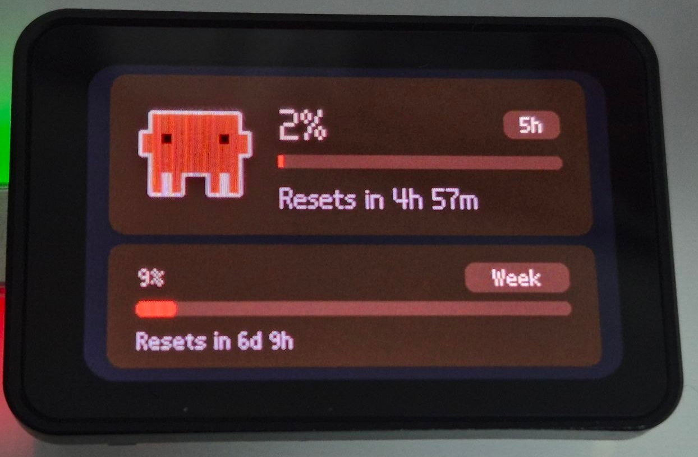
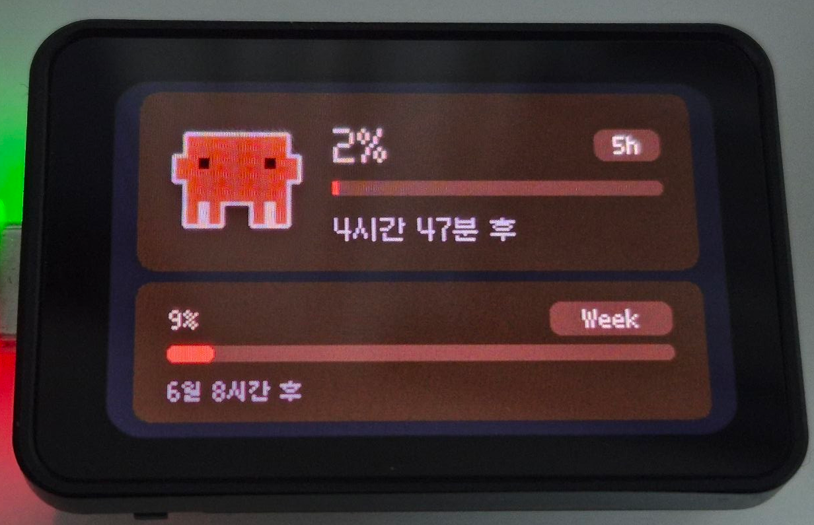

# QuotaDock

[English](README.md) | [日本語](README.ja.md) | [简体中文](README.zh.md)

책상 위 작은 AMOLED 화면에 Claude와 Codex의 남은 사용량을 띄워주는 데스크 가젯입니다.

  
  

## 준비물

- [ESP32-S3-Touch-AMOLED-1.64](https://www.waveshare.com/wiki/ESP32-S3-Touch-AMOLED-1.64) 보드
- USB-C 케이블
- 2.4GHz Wi-Fi 네트워크

## 설치

1. [Releases](../../releases) 페이지에서 운영체제에 맞는 최신 QuotaDock 데스크톱 앱을 내려받습니다.
2. 보드를 USB-C로 컴퓨터에 연결합니다.
3. 내려받은 앱을 실행합니다.

## 사용법

1. 앱을 열고 ESP32-S3를 연결하면 이를 자동으로 찾습니다.
2. 처음이라면 안내에 따라 펌웨어를 플래시하고 Wi-Fi 정보를 입력해 기기를 설정합니다.
3. 설정이 끝나면 Claude·Codex 사용량이 기기 화면에 표시되고, 앱이 주기적으로 자동 동기화합니다.

추가로 지원하는 기능:

- 프로바이더별 아이콘 이미지 지정

## 참고

- 사용량 조회 로직은 [CodexBar](https://github.com/steipete/codexbar)를 참고했습니다.

## 라이선스

이 프로젝트는 [MIT 라이선스](LICENSE)로 배포됩니다.

갈무리(Galmuri) 폰트는 SIL Open Font License 1.1에 따라 별도로 라이선스되며, 저작권은 폰트 제작자에게 있습니다. 자세한 내용은 [갈무리 폰트 저장소](https://github.com/quiple/galmuri)를 참고하세요.
